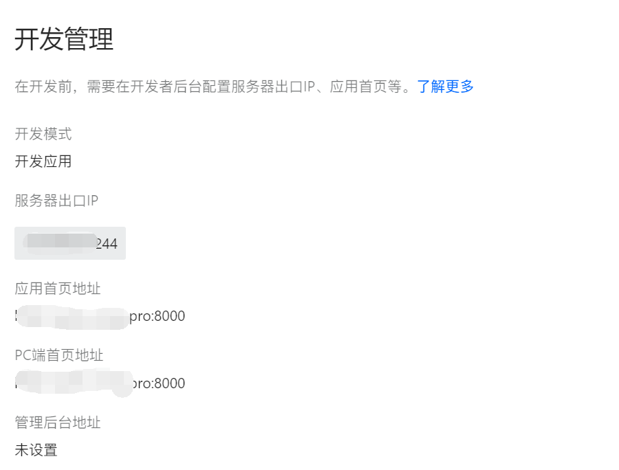
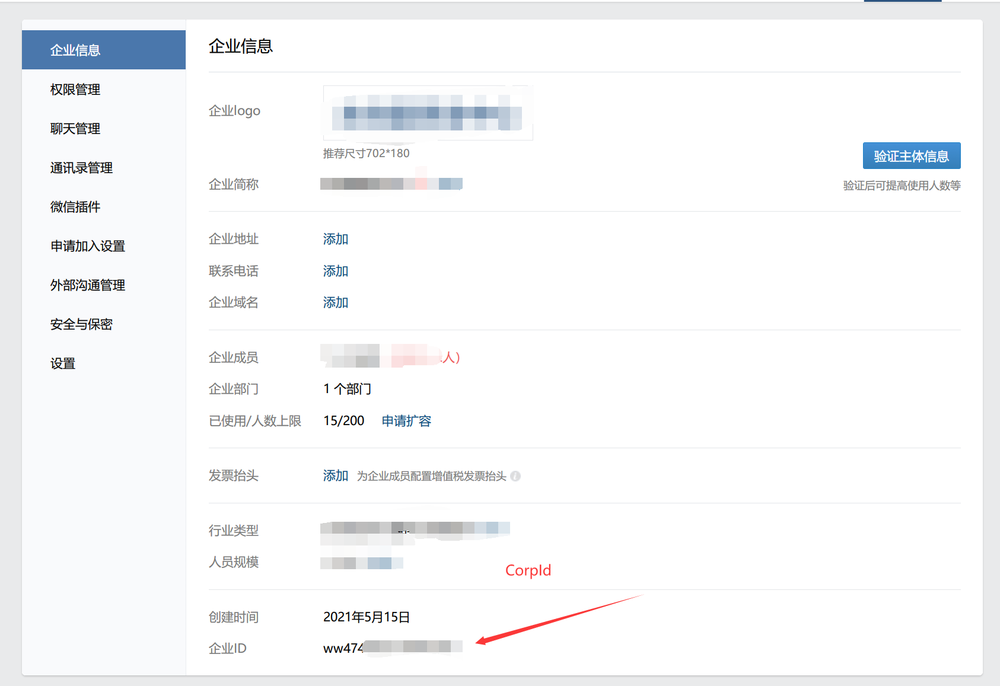
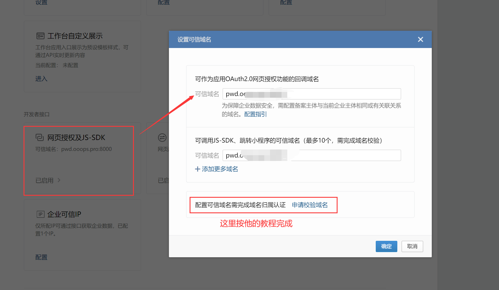
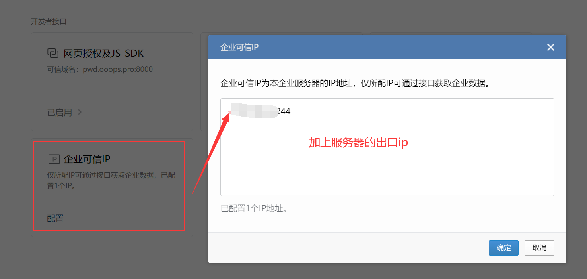
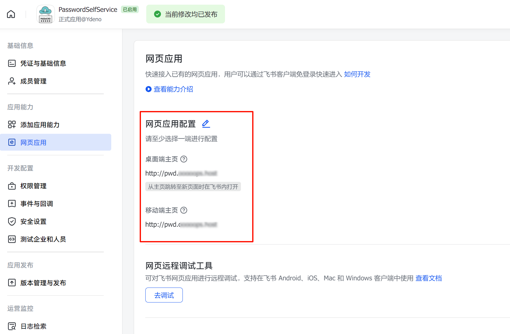
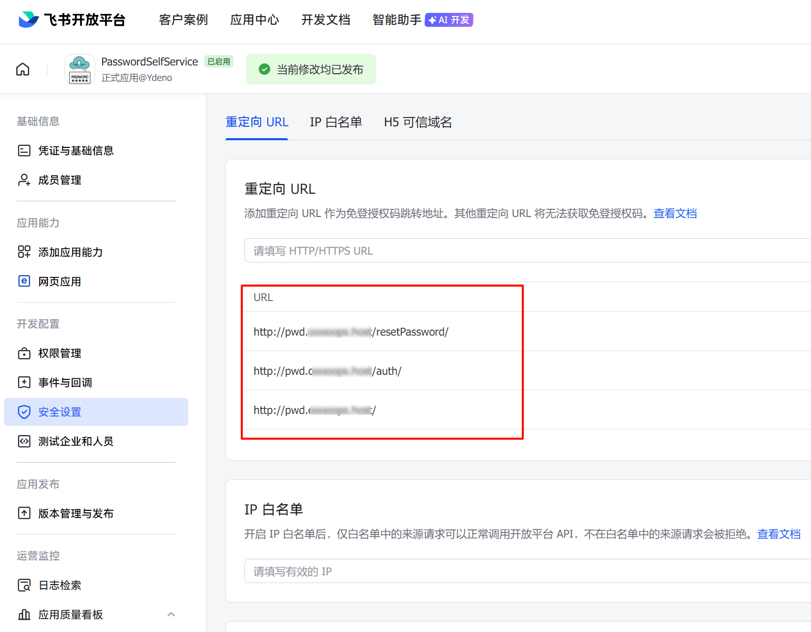
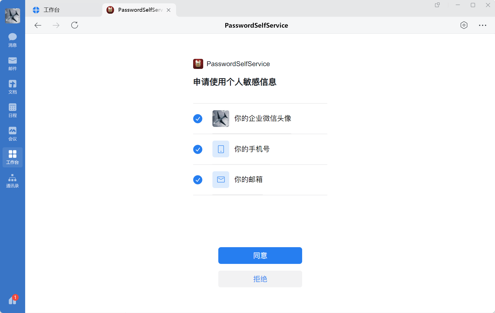
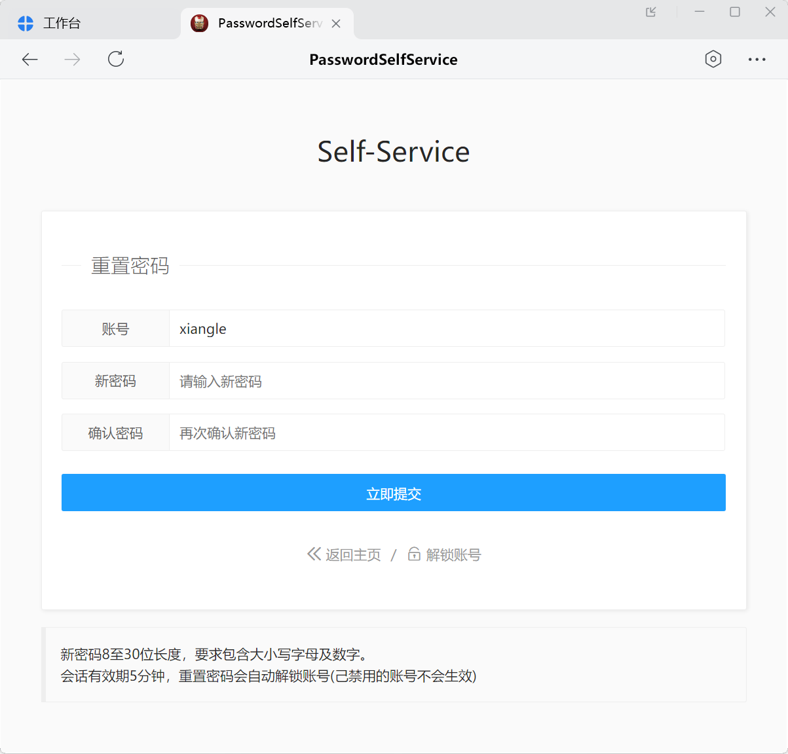
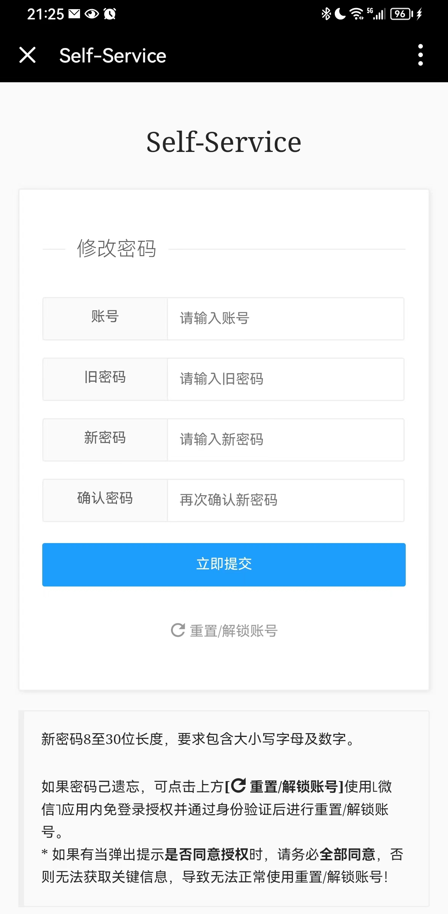

# AD Self-Service Password Platform

## 📋 目录

- [概述](#概述)
- [核心功能](#核心功能)
- [系统架构](#系统架构)
- [快速开始](#快速开始)
- [配置指南](#配置指南)
- [OAuth 认证配置](#oauth-认证配置)
  - [钉钉配置](#钉钉-dingtalk-配置)
  - [企业微信配置](#企业微信-wechat-配置)
  - [飞书配置](#飞书-feishu-配置)
- [LDAP/AD 配置](#ldapad-配置)
- [AD 服务账号权限配置](#ad-服务账号权限配置)
- [运行方式](#运行方式)
- [扩展开发指南](#扩展开发指南)
- [界面效果](#界面效果)

---

## 概述

**AD 自助密码服务平台**是一个基于 Django 开发的企业级员工自助密码管理系统，为用户提供安全、便捷的密码重置、修改和账户解锁服务。

### 核心优势
- ✅ **双后端支持**：同时支持 Active Directory (AD) 和 OpenLDAP
- ✅ **多种身份验证**：集成钉钉、企业微信、飞书认证方式
- ✅ **安全可靠**：支持 SSL/TLS 加密传输，服务账号权限最小化
- ✅ **开箱即用**：配置文件完善，支持多环境部署
- ✅ **移动友好**：原生支持钉钉/企业微信/飞书移动端应用
- ✅ **可扩展性**：工厂模式设计，易于扩展新的 OAuth 提供商和 SMS 服务商

---

## 核心功能

### 1. 密码重置（Password Reset）
用户通过验证身份后，可以自助重置 AD/LDAP 账户密码，支持：
- OAuth 身份验证（自动跳转）
- 手动邮箱/用户名验证
- 自定义密码复杂度策略验证
- 密码修改日志审计

### 2. 账户解锁（Account Unlock）
解锁被锁定的 AD 账户，支持：
- 多种身份识别方式
- SMS 短信验证（可选的二次验证）
- 自动恢复账户锁定状态

### 3. 密码修改（Password Change）
支持已认证用户修改密码，保持密码合规性：
- 旧密码验证
- 新密码复杂度检查

### 4. 身份验证
支持认证方式：
- **OAuth 认证**：钉钉、企业微信（企业级应用）
- **SMS 二次验证**：支持阿里云、腾讯云、华为云等 SMS 服务商

---

## 系统架构

### 分层设计


### 核心组件说明

| 组件 | 职责 | 位置 |
|------|------|------|
| **LDAPFactory** | 根据配置自动创建 AD 或 OpenLDAP 适配器 | `utils/ldap/factory.py` |
| **ADAdapter** | 处理 AD 特定操作（NTLM 认证、unicodePwd 属性、lockoutTime 等） | `utils/ldap/ad_adapter.py` |
| **OpenLDAPAdapter** | 处理 OpenLDAP 特定操作（Simple 认证、userPassword 属性等） | `utils/ldap/openldap_adapter.py` |
| **OAuthFactory** | 创建钉钉/企业微信 OAuth 提供商 | `utils/oauth/factory.py` |
| **ConfigManager** | 单例配置管理，支持 YAML 加载和环境变量注入 | `utils/config/config_manager.py` |
| **ResponseBuilder** | 统一构建 API 响应和页面响应上下文 | `apps/password_manager/response_handler.py` |
| **SMSFactory** | 创建多种 SMS 服务提供商 | `utils/sms/factory.py` |

---

## 快速开始

### 环境要求
- Python 3.10+
- Django 5.2+
- LDAP3 2.9+
- ldap3[gssapi] (可选，用于 Kerberos 认证)


### 本地开发环境设置

#### Windows 开发环境

```cmd
# 1. 创建虚拟环境
python -m venv venv
venv\Scripts\activate

# 2. 安装依赖
pip install -r requirements.txt

# 3. 设置环境变量
set APP_ENV=dev

# 4. 启动开发服务器
python manage.py runserver 0.0.0.0:8000
```

#### Linux/Mac 开发环境

```bash
# 1. 创建虚拟环境
python3 -m venv venv
source venv/bin/activate

# 2. 安装依赖
pip install -r requirements.txt

# 3. 设置环境变量
export APP_ENV=dev

# 4. 启动开发服务器
python manage.py runserver 0.0.0.0:8000
```

### 访问应用

打开浏览器访问：`http://localhost:8000`

---

## 配置指南

### 配置文件位置和优先级

系统按如下优先级加载配置：

1. **环境变量方式**（如果设置了 `APP_ENV`）：`conf/config.{APP_ENV}.yaml`
2. **默认配置**（备选）：`conf/config.yaml`
3. **示例配置**（参考）：`conf/config.yaml.example`

### 初始化配置

```bash
# 1. 复制配置模板
copy conf/config.yaml.example conf/config.dev.yaml

# 2. 编辑配置文件，填入实际的 LDAP 服务器信息
# 3. 设置敏感信息为环境变量（密码、密钥等）
```

### 配置文件结构说明
 > 更多配置项说明请参考 `conf/config.yaml.example` 文件中的注释
```yaml
# 应用基础配置
app:
  title: "Self-Service Password Platform"
  debug: false  # 生产环境必须为 false
  secret_key: ""  # Django 会话加密密钥
  allowed_hosts:
    - "*"  # 生产环境应指定具体域名

# OAuth 认证提供商
auth:
  provider: "wework"  # "ding" 或 "wework"
  session_timeout: 300

# LDAP 后端配置
ldap:
  type: "ad"  # "ad" 或 "openldap"
  host: "ad.company.com"
  port: 636
  use_ssl: true  # 密码修改必须使用 SSL
  base_dn: "dc=company,dc=com"
  login_user: "DOMAIN\svc_account"
  login_password: "${LDAP_PASSWORD}"  # 从环境变量读取

# SMS 短信服务
sms:
  provider: "mock"  # "aliyun", "tencent", "huawei", "mock"
```

### 环境变量注入

配置文件支持 `${VAR_NAME}` 格式的环境变量引用，用于保护敏感信息（如密码、密钥等）。
> 同时你也可以直接在配置文件中明文写入这些信息，直接通过配置文件加载

#### 两种配置方式对比

| 方式 | 适用场景 | 安全性 | 示例 |
|------|---------|--------|------|
| **直接写入配置** | 开发环境、非敏感配置 | ⚠️ 配置文件明文存储 | `app_id: "cli_xxx"` |
| **环境变量注入** | 生产环境、敏感信息 | ✅ 不存储在配置文件中 | `app_id: "${FEISHU_APP_ID}"` |

> **推荐**：生产环境务必使用环境变量方式配置敏感信息，避免密钥泄露风险。

#### 环境变量语法

```yaml
# 基本语法：${环境变量名}
ldap:
  login_password: "${LDAP_PASSWORD}"

# 带默认值语法：${环境变量名:默认值}
# 如果环境变量未设置，则使用默认值
ldap:
  host: "${LDAP_HOST:ad.company.com}"
```

#### 设置环境变量
> 如果采用`conf/config.{APP_ENV}.yaml`中直接配置了敏感信息，则无需设置环境变量

**Windows (CMD):**
```cmd
set LDAP_PASSWORD=your_password
set FEISHU_APP_ID=cli_xxxxxxxxx
set FEISHU_APP_SECRET=xxxxxxxxxxxxxxxx
```

**Windows (PowerShell):**
```powershell
$env:LDAP_PASSWORD = "your_password"
$env:FEISHU_APP_ID = "cli_xxxxxxxxx"
$env:FEISHU_APP_SECRET = "xxxxxxxxxxxxxxxx"
```

**Linux/Mac:**
```bash
export LDAP_PASSWORD=your_password
export FEISHU_APP_ID=cli_xxxxxxxxx
export FEISHU_APP_SECRET=xxxxxxxxxxxxxxxx
```

**Docker Compose (.env 文件):**
```ini
# .env 文件
LDAP_PASSWORD=your_password
FEISHU_APP_ID=cli_xxxxxxxxx
FEISHU_APP_SECRET=xxxxxxxxxxxxxxxx
```

#### 完整环境变量清单

以下是所有支持环境变量注入的配置项：

| 环境变量 | 配置路径 | 说明 |
|---------|---------|------|
| `LDAP_PASSWORD` | `ldap.login_password` | LDAP 服务账号密码 |
| `LDAP_HOST` | `ldap.host` | LDAP 服务器地址（可选默认值） |
| `DING_CORP_ID` | `ding_oauth.corp_id` | 钉钉企业 ID |
| `DING_AGENT_ID` | `ding_oauth.agent_id` | 钉钉应用 ID |
| `DING_APP_KEY` | `ding_oauth.app_key` | 钉钉应用 Key |
| `DING_APP_SECRET` | `ding_oauth.app_secret` | 钉钉应用密钥 |
| `WEWORK_CORP_ID` | `wework_oauth.corp_id` | 企业微信企业 ID |
| `WEWORK_AGENT_ID` | `wework_oauth.agent_id` | 企业微信应用 ID |
| `WEWORK_APP_KEY` | `wework_oauth.app_key` | 企业微信应用 Key |
| `WEWORK_APP_SECRET` | `wework_oauth.app_secret` | 企业微信应用密钥 |
| `FEISHU_APP_ID` | `oauth_providers.feishu.app_id` | 飞书应用 ID |
| `FEISHU_APP_SECRET` | `oauth_providers.feishu.app_secret` | 飞书应用密钥 |
| `SMS_ACCESS_KEY` | `sms.aliyun.access_key_id` | 阿里云 AccessKey |
| `SMS_ACCESS_SECRET` | `sms.aliyun.access_key_secret` | 阿里云 AccessSecret |
| `TENCENT_SMS_SECRET_ID` | `sms.tencent.secret_id` | 腾讯云 SecretId |
| `TENCENT_SMS_SECRET_KEY` | `sms.tencent.secret_key` | 腾讯云 SecretKey |

#### 配置示例（环境变量方式）

```yaml
# conf/config.prod.yaml - 生产环境配置示例

# LDAP 配置
ldap:
  type: "ad"
  host: "${LDAP_HOST:ad.company.com}"
  port: 636
  use_ssl: true
  base_dn: "dc=company,dc=com"
  login_user: "COMPANY\svc_pwd_reset"
  login_password: "${LDAP_PASSWORD}"

# OAuth 配置（以飞书为例）
auth:
  provider: "feishu"

oauth_providers:
  feishu:
    app_id: "${FEISHU_APP_ID}"
    app_secret: "${FEISHU_APP_SECRET}"

# SMS 配置（以阿里云为例）
sms:
  enabled: true
  provider: "aliyun"
  aliyun:
    access_key_id: "${SMS_ACCESS_KEY}"
    access_key_secret: "${SMS_ACCESS_SECRET}"
    sign_name: "密码服务"
    template_code: "SMS_123456789"
```

---

## OAuth 认证配置

### 钉钉 (DingTalk) 配置

#### 第一步：在钉钉工作台创建应用

1. 登录 [钉钉开发者后台](https://open.dingtalk.com/)
2. 点击"自建应用" → "创建应用"
3. 选择应用类型为 **"H5 微应用"**
4. 填写应用基本信息

#### 第二步：获取必要的凭证

创建成功后，在应用首页获取：
- **AgentId**：应用 ID
- **AppKey**（CorpId）：企业 ID
- **AppSecret**：应用密钥

#### 第三步：配置权限

在应用权限中勾选：
- ✅ 通讯录只读权限
- ✅ 邮箱、手机号等个人信息
- ✅ 设置权限范围为"全部员工"或自行选择

#### 第四步：配置安全域名

在应用管理中配置：
- **安全域名**：`pwd.company.com`
- **IP 地址**：应用服务器的公网 IP
- **回调地址**：`pwd.company.com/auth`（可选，可自动跳过授权页面）

#### 第五步：修改 config.yaml

```yaml
auth:
  provider: "ding"

oauth:
  user_identifier_mapping:
    ding:
      primary: "orgEmail"  # 优先使用企业邮箱
      fallback:
        - "biz_mail"  # 备选：业务邮箱
        - "mobile"    # 备选：手机号

# 钉钉 OAuth 应用配置（通过环境变量注入）
ding_oauth:
  corp_id: "${DING_CORP_ID}"
  agent_id: "${DING_AGENT_ID}"
  app_key: "${DING_APP_KEY}"
  app_secret: "${DING_APP_SECRET}"
```

设置环境变量：

```bash
set DING_CORP_ID=ding1234567890
set DING_AGENT_ID=1234567
set DING_APP_KEY=dingxxxxx
set DING_APP_SECRET=dingyyyyy
```

参考截图配置：




---

### 企业微信配置

#### 第一步：创建应用

1. 登录企业微信管理后台
2. 进入"应用管理" → "创建应用"
3. 选择应用类型为 **"H5 应用"**
4. 填写应用名称和相关信息

#### 第二步：获取企业凭证

- **企业 ID (CorpId)**：企业微信的唯一标识
- **应用 ID (AgentID)**：应用的唯一标识
- **应用密钥 (Secret)**：应用的密钥

#### 第三步：配置权限

应用需要获取以下权限：
- ✅ 读取企业通讯录（用户信息）

#### 第四步：配置网页授权及 J-SDK

在应用管理中配置：
- **可信域名**：`pwd.company.com`
- **网页授权回调域名**：`pwd.company.com`
- **企业可信 IP**：应用服务器的公网 IP

#### 第五步：修改 config.yaml

```yaml
auth:
  provider: "wework"

oauth:
  user_identifier_mapping:
    wework:
      primary: "email"  # 优先使用邮箱
      fallback:
        - "mobile"  # 备选：手机号
        - "userid"  # 备选：用户 ID

# 企业微信 OAuth 应用配置（通过环境变量注入）
wework_oauth:
  corp_id: "${WEWORK_CORP_ID}"
  agent_id: "${WEWORK_AGENT_ID}"
  app_key: "${WEWORK_APP_KEY}"
  app_secret: "${WEWORK_APP_SECRET}"
```

设置环境变量：

```bash
set WEWORK_CORP_ID=wechatxxxxx
set WEWORK_AGENT_ID=1000001
set WEWORK_APP_KEY=wechatkey
set WEWORK_APP_SECRET=wechatsecret
```

参考截图：






---

### 飞书 (Feishu) 配置

#### 第一步：创建企业自建应用

1. 登录 [飞书开发者后台](https://open.feishu.cn/app)
2. 点击"创建企业自建应用"
3. 填写应用名称和描述


#### 第二步：获取应用凭证

在应用"凭证与基础信息"页面获取：
- **App ID**：应用唯一标识
- **App Secret**：应用密钥



#### 第三步：配置网页应用

1. 进入"应用功能" → "网页"
2. 点击"添加网页应用"
3. 配置应用信息


#### 第四步：配置权限

在"权限管理"中启用必要的权限：
- ✅ `contact:user.base:readonly` - 获取用户基本信息
- ✅ `contact:user.employee_id:readonly` - 获取员工工号（可选）
- ✅ `auth:user.id:read` - 获取用户 ID



#### 第五步：配置安全设置

在"安全设置"中配置：
> 切记要以/结尾，否则会导致授权失败！
1. **重定向 URL**：添加回调地址
   - 格式：`https://pwd.company.com/resetPassword/
   
2. **H5 可信域名**：添加应用域名
   - 格式：`pwd.company.com/`


#### 第六步：创建版本并发布

1. 进入"版本管理与发布"
2. 创建新版本
3. 提交审核并发布

#### 第七步：修改 config.yaml

```yaml
auth:
  provider: "feishu"

oauth:
  user_identifier_mapping:
    feishu:
      primary: "email"  # 优先使用邮箱
      fallback:
        - "mobile"  # 备选：手机号
        - "open_id"  # 备选：飞书用户ID

# 飞书 OAuth 应用配置
feishu_oauth:
  app_id: "${FEISHU_APP_ID}"
  app_secret: "${FEISHU_APP_SECRET}"
  user_identifier_mapping: "open_id"  # 用户标识字段：open_id、union_id、user_id
```

设置环境变量：

```bash
set FEISHU_APP_ID=cli_xxxxxxxxxxxxx
set FEISHU_APP_SECRET=xxxxxxxxxxxxxxxxxxxxxxxxxx
```

---

## LDAP/AD 配置

### 配置选项说明

#### 通用 LDAP 配置（AD 和 OpenLDAP 共用）

```yaml
ldap:
  type: "ad"  # 选择 "ad" 或 "openldap"
  
  # 服务器连接
  host: "ad.company.com"      # LDAP 服务器地址
  port: 636                   # SSL: 636, 非 SSL: 389
  use_ssl: true               # 密码修改必须启用 SSL
  
  # 认证信息
  login_user: "DOMAIN\svc_account"     # 服务账号
  login_password: "${LDAP_PASSWORD}"   # 密码（使用环境变量）
  
  # 搜索配置
  base_dn: "dc=company,dc=com"  # LDAP 搜索基准
  search_filter: ""              # 自定义搜索过滤器（空则使用默认）
```

#### Active Directory (AD) 专用配置

```yaml
ldap:
  ad:
    # 认证方式
    authentication: "ntlm"  # "ntlm"（推荐）或 "simple"
    
    # 属性映射
    attributes:
      password: "unicodePwd"          # AD 密码属性
      username: "sAMAccountName"      # 用户名属性
      lockout_time: "lockoutTime"     # 锁定状态属性
      account_control: "userAccountControl"  # 账号状态
    
    # TLS/SSL 证书验证
    tls:
      validate: "none"              # "none"、"optional"、"required"
      ca_certs_file: ""             # CA 证书路径
      validate_hostname: true       # 验证主机名
```

#### OpenLDAP 专用配置

```yaml
ldap:
  openldap:
    # 认证方式
    authentication: "simple"  # OpenLDAP 使用 SIMPLE 认证
    
    # 属性映射
    attributes:
      password: "userPassword"       # OpenLDAP 密码属性
      username: "uid"                # 用户名属性
      lockout_time: "pwdAccountLockedTime"  # 锁定属性
    
    # 密码加密算法
    password_hash: "ssha"  # "ssha"、"sha"、"md5" 等
    
    # ppolicy (Password Policy) 配置
    ppolicy:
      enabled: true
```

---

## AD 前置条件

### ⚠️ SSL/TLS 配置要求（关键）

在使用 Active Directory 进行密码重置或账户解锁之前，**必须确保 AD 服务器已启用 SSL/TLS 加密连接**。这是 AD 密码修改操作的强制要求。

#### 为什么需要 SSL？

- **安全性**：密码在网络传输中必须加密，AD 不允许通过明文连接修改密码
- **认证协议**：AD 的 `unicodePwd` 属性修改只能在 SSL 连接上进行

#### AD 服务器 SSL 配置检查

请 AD 管理员验证以下项：

1. **证书安装**
   ```powershell
   # 查看 AD 证书
   Get-ADCertificate -Filter {Subject -like "*LDAPS*"}
   ```

2. **LDAPS 端口启用**（默认 636）
   ```bash
   # 测试 LDAPS 连接
   telnet ad.company.com 636
   ```

3. **应用配置**
   ```yaml
   ldap:
     host: "ad.company.com"
     port: 636              # SSL 端口
     use_ssl: true          # 必须设置为 true
     use_tls: false         # 与 use_ssl 互斥
   ```

#### 常见问题排查

| 问题 | 原因 | 解决方案 |
|------|------|--------|
| "Connection refused" | LDAPS 未启用 | 联系 AD 管理员启用 LDAPS |
| "SSL: CERTIFICATE_VERIFY_FAILED" | CA 证书不受信任 | 配置 `ldap.ad.tls.ca_certs_file` |
| "Reset password failed" | 使用了非 SSL 连接 | 确保 `use_ssl: true` 且 `port: 636` |

---

## AD 服务账号权限配置

### 为什么需要服务账号？

密码重置和账户解锁操作需要在 AD 中执行修改操作，这些操作只能由具有特定权限的服务账号来进行。通过使用最小权限原则（Principle of Least Privilege），服务账号只被赋予必要的权限，增强系统安全性。

⚠️ **前置条件**：在完成以下步骤前，请确保已按照上一节的要求配置 AD SSL/TLS。

### 配置步骤

#### Step 1: 创建服务账号

在 AD 管理员机器上运行 PowerShell（需要 Admin 权限）：

```powershell
# ===== 基础变量 =====
# 账号显示名 (请根据实际情况修改)
$Name              = "SvcPasswordReset"
# 登录账号名 (请根据实际情况修改)
$SamAccountName    = "svc_pwd_reset"
# 用户主名 (UPN) (请根据实际情况修改)
$UPNSuffix         = "company.com"
# 完整 UPN (请根据实际情况修改)
$UserPrincipalName = "$SamAccountName@$UPNSuffix"
# OU 路径 (请根据实际情况修改)
$OUPath            = "OU=ServiceAccounts,OU=Users,DC=company,DC=com"
# 密码 (请根据实际情况修改)
$PlainPassword     = "ComplexPassword123!"
# 账号密码（请根据公司密码策略设置复杂密码）
$SecurePassword    = ConvertTo-SecureString $PlainPassword -AsPlainText -Force
# 账号描述
$Description       = "自助密码重置服务账号（仅密码重置权限）"

# ===== 创建用户 =====
New-ADUser -Name $Name `
           -SamAccountName $SamAccountName `
           -UserPrincipalName $UserPrincipalName `
           -AccountPassword $SecurePassword `
           -Enabled $true `
           -PasswordNeverExpires $true `
           -Description $Descripti
```

**参数说明：**
- `-Name`：账号显示名称
- `-SamAccountName`：登录账号（Windows 登录使用）
- `-UserPrincipalName`：用户主名（UPN 格式）
- `-PasswordNeverExpires`：密码永不过期
- `-Enabled`：启用账号

#### Step 2: 授予委派权限

为服务账号分配必要权限，仅限于特定 OU 内的用户操作：

```powershell
# 定义目标 OU（包含需要重置密码的用户）
$targetOU = "OU=Employees,DC=company,DC=com"
$targetDomain = "COMPANY"
$targerAccount = "$targetDomain\svc_pwd_reset"

# Reset password
dsacls $targetOU /I:S /G "$targetDOMAIN\svc_pwd_reset:CA;Reset Password;user"

# Unlock account
dsacls $targetOU /I:S /G "$targetDOMAIN\svc_pwd_reset:RP;lockoutTime;user"
dsacls $targetOU /I:S /G "$targetDOMAIN\svc_pwd_reset:WP;lockoutTime;user"

# Account status checks
dsacls $targetOU /I:S /G "$targetDOMAIN\svc_pwd_reset:RP;userAccountControl;user"

# Password state control
dsacls $targetOU /I:S /G "$targetDOMAIN\svc_pwd_reset:RP;pwdLastSet;user"
dsacls $targetOU /I:S /G "$targetDOMAIN\svc_pwd_reset:WP;pwdLastSet;user"

```

**权限说明：**

| 权限代码 | 中文说明 | 用途 |
|---------|--------|------|
| `CA;Reset Password` | 控制访问：重置密码 | 用户密码重置 |
| `RP;lockoutTime` | 读取属性：锁定时间 | 检查账号是否被锁定 |
| `WP;lockoutTime` | 写入属性：锁定时间 | 解锁账号（设置为 0） |
| `RP;userAccountControl` | 读取属性：账号控制 | 检查账号启用/禁用状态 |

#### Step 3: 验证权限

在本地测试机上验证服务账号权限：

```powershell
# 使用服务账号凭证连接到 AD
$cred = Get-Credential -UserName "COMPANY\svc_pwd_reset"

# 测试：重置用户密码
Set-ADAccountPassword -Identity "testuser" `
                       -Reset `
                       -NewPassword (ConvertTo-SecureString "NewTestPwd123!" -AsPlainText -Force) `
                       -Credential $cred
# 应该成功 ✓

# 测试：解锁账户
Unlock-ADAccount -Identity "testuser" -Credential $cred
# 应该成功 ✓

# 测试：删除用户（应该失败，证明权限最小化）
Remove-ADUser -Identity "testuser" -Credential $cred
# 应该失败 （权限不足）
```

### 在 config.yaml 中配置服务账号

```yaml
ldap:
  type: "ad"
  host: "ad.company.com"
  domain: "company.com"
  port: 636
  use_ssl: true
  base_dn: "dc=company,dc=com"
  
  # 服务账号凭证
  login_user: "COMPANY\svc_pwd_reset"
  login_password: "${LDAP_PASSWORD}" 
  
  ad:
    authentication: "ntlm"
```

然后设置环境变量：

```bash
set LDAP_PASSWORD=ComplexPassword123!
```

或在 `.env` 文件中配置：

```ini
LDAP_PASSWORD=ComplexPassword123!
```

---

## 运行方式

### 生产环境推荐方案：Docker Compose

**强烈推荐在生产环境使用 docker-compose 部署**，本项目已包含完整的 `docker-compose.yaml` 配置，支持一键启动、自动管理、日志聚合等功能。

Docker国内可直接访问清华大学的镜像源：https://mirrors.tuna.tsinghua.edu.cn/help/docker-ce/
根据页面的指引完成Docker的安装和配置（新版本docker已内置compose）

```bash
# 1. 创建环境变量文件，并根据实际情况修改文件内容
copy .env.example .env

# 2. 启动容器（后台运行）
docker compose up -d

# 3 查看服务日志
docker compose logs -f

# 4 停止服务
docker compose down

# 5 升级或更新
docker compose build  # Build最新镜像
docker compose up -d --force-recreate        # 重新创建容器
```

**如果环境需要启用HTTPS**，请参考以下步骤：
1. 在 `.env` 中修改 `ENABLE_HTTPS=true`
2. 生成或购买 SSL 证书，确保证书包含 `pwd.company.com` 的域名，并且证书链完整（包括中间证书）
3. 确认使用的证书文件名，修改`.env`文件中的`CERT_FILE_NAME`和`KEY_FILE_NAME`为实际的证书文件名（不带路径）
4. 将对应名称的证书和私钥文件到项目的run/nginx/certs目录下

> 参考项目的 `docker-compose.yaml`

---

## 扩展开发指南

本系统采用工厂模式设计，支持自定义扩展 OAuth 提供商和 SMS 服务商。

### 自定义 OAuth Provider

#### 1. 创建 Provider 文件

在 `utils/oauth/providers/` 目录下创建新的 Provider 文件，例如 `myprovider_provider.py`：

```python
# utils/oauth/providers/myprovider_provider.py
# -*- coding: utf-8 -*-
from typing import Tuple, Optional, Dict, Any
from utils.oauth.base_provider import BaseOAuthProvider
from utils.config import get_config
from utils.logger_factory import get_logger

logger = get_logger(__name__)


class MyProvider(BaseOAuthProvider):
    """
    自定义 OAuth 提供商
    
    配置项（在 oauth_providers.myprovider 下）：
    - app_id: 应用 ID
    - app_secret: 应用密钥
    """
    
    def __init__(self):
        """初始化提供商"""
        super().__init__()
        
        config = get_config()
        provider_config = config.get_dict('oauth_providers.myprovider')
        
        self._app_id = provider_config.get('app_id', '')
        self._app_secret = provider_config.get('app_secret', '')
        
        if self._app_id and self._app_secret:
            logger.info(f"[MyProvider] OAuth 提供商初始化成功")
        else:
            logger.warning("[MyProvider] OAuth 提供商配置不完整")
    
    @property
    def provider_name(self) -> str:
        """提供商名称"""
        return "我的提供商"
    
    @property
    def provider_type(self) -> str:
        """提供商类型（用于配置文件中的 provider 字段）"""
        return "myprovider"
    
    @property
    def corp_id(self) -> str:
        """企业ID"""
        return self._app_id
    
    @property
    def app_id(self) -> str:
        """应用ID"""
        return self._app_id
    
    def get_auth_config(self, home_url: str, redirect_url: str) -> Dict[str, Any]:
        """
        获取前端 OAuth 授权配置
        
        返回的配置将传递给前端 auth.html 中的 OAuth 初始化函数
        """
        return {
            'provider_type': self.provider_type,
            'provider_name': self.provider_name,
            'app_id': self._app_id,
            'redirect_url': redirect_url,
            # 添加其他前端需要的配置
        }
    
    def get_user_detail(self, code: str, home_url: str) -> Tuple[bool, Any, Optional[Dict[str, Any]]]:
        """
        通过授权码获取用户详情（核心方法）
        
        Args:
            code: OAuth 授权码
            home_url: 主页 URL
            
        Returns:
            (成功状态, 用户ID/错误消息, 用户信息字典/错误信息)
        """
        try:
            # 1. 使用 code 换取 access_token
            # 2. 使用 access_token 获取用户信息
            # 3. 返回用户标识和用户信息
            
            user_id = "extracted_user_id"
            user_info = {
                'email': 'user@example.com',
                'mobile': '13800138000',
                'name': '用户名',
            }
            
            return True, user_id, user_info
            
        except Exception as e:
            logger.error(f"[MyProvider] 获取用户详情失败: {e}")
            return False, str(e), None
    
    def get_user_id_by_code(self, code: str) -> Tuple[bool, Optional[str]]:
        """通过授权码获取用户ID"""
        # 实现逻辑...
        pass
    
    def get_user_detail_by_user_id(self, user_id: str) -> Tuple[bool, Optional[Dict[str, Any]]]:
        """通过用户ID获取用户详情"""
        # 实现逻辑...
        pass
```

#### 2. 添加配置

在 `config.yaml` 中添加配置：

```yaml
auth:
  provider: "myprovider"  # 使用自定义提供商

oauth:
  user_identifier_mapping:
    myprovider:
      primary: "email"
      fallback:
        - "mobile"

# 自定义 OAuth 提供商配置
oauth_providers:
  myprovider:
    app_id: "${MYPROVIDER_APP_ID}"
    app_secret: "${MYPROVIDER_APP_SECRET}"
```

#### 3. 自动注册

系统会自动扫描 `utils/oauth/providers/` 目录下的 `*_provider.py` 文件，并自动注册 Provider。无需手动修改工厂代码。

#### 4. 前端适配（可选）

如果需要自定义前端授权流程，在 `templates/auth.html` 中添加对应的处理逻辑：

```javascript
// 在 oauthProviders 对象中添加
myprovider: {
    init: function(config, onSuccess, onError) {
        // 构建授权 URL
        const redirectUri = encodeURIComponent(config.redirect_url);
        const url = `https://auth.myprovider.com/authorize?client_id=${config.app_id}&redirect_uri=${redirectUri}&response_type=code`;
        onSuccess(url);
    }
}
```

---

### 自定义 SMS Provider

#### 1. 创建 Provider 文件

在 `utils/sms/providers/` 目录下创建新的 Provider 文件，例如 `myprovider_provider.py`：

```python
# utils/sms/providers/myprovider_provider.py
# -*- coding: utf-8 -*-
from typing import Tuple, Dict, Any, Optional
from utils.sms.base_provider import BaseSMSProvider
from utils.sms.exceptions import SMSException, SMSErrorCode
from utils.config import get_config
from utils.logger_factory import get_logger

logger = get_logger(__name__)


class MySMSProvider(BaseSMSProvider):
    """
    自定义短信提供商
    
    配置项（在 sms.myprovider 下）：
    - api_key: API 密钥
    - api_secret: API 密钥
    - sign_name: 短信签名
    - template_code: 模板代码
    """
    
    def __init__(self):
        """初始化短信提供商"""
        super().__init__()
        
        sms_config = self.config.get_dict('sms.myprovider')
        
        self._api_key = sms_config.get('api_key', '')
        self._api_secret = sms_config.get('api_secret', '')
        self._sign_name = sms_config.get('sign_name', '')
        self._template_code = sms_config.get('template_code', '')
        
        if self._api_key and self._api_secret:
            logger.info(f"[MySMSProvider] 短信提供商初始化成功")
        else:
            logger.warning("[MySMSProvider] 短信提供商配置不完整")
    
    @property
    def provider_name(self) -> str:
        """提供商名称"""
        return "我的短信服务"
    
    @property
    def provider_type(self) -> str:
        """提供商类型（用于配置文件中的 provider 字段）"""
        return "myprovider"
    
    def send_verification_code(
        self,
        mobile: str,
        code: str,
        template_params: Optional[Dict[str, Any]] = None
    ) -> Tuple[bool, str]:
        """
        发送验证码短信（核心方法）
        
        Args:
            mobile: 手机号（已格式化）
            code: 验证码
            template_params: 模板参数
            
        Returns:
            (成功状态, 消息ID或错误信息)
        """
        try:
            # 实现短信发送逻辑
            # 示例：调用第三方 API
            
            # 构建请求参数
            params = {
                'phone': mobile,
                'sign': self._sign_name,
                'template': self._template_code,
                'params': {'code': code}
            }
            
            # 调用 API（示例）
            # response = requests.post(api_url, json=params, headers=headers)
            
            # 模拟成功
            message_id = f"msg_{mobile}_{code}"
            logger.info(f"[MySMSProvider] 短信发送成功: {mobile}")
            
            return True, message_id
            
        except Exception as e:
            logger.error(f"[MySMSProvider] 短信发送失败: {e}")
            return False, str(e)
    
    def query_send_status(self, message_id: str) -> Tuple[bool, str]:
        """
        查询短信发送状态
        
        Args:
            message_id: 短信消息ID
            
        Returns:
            (查询成功, 状态描述)
        """
        # 实现状态查询逻辑
        return True, "已送达"
    
    def validate_config(self) -> Tuple[bool, str]:
        """
        验证配置是否完整
        
        Returns:
            (配置有效, 错误信息)
        """
        if not self._api_key:
            return False, "缺少 api_key 配置"
        if not self._api_secret:
            return False, "缺少 api_secret 配置"
        if not self._sign_name:
            return False, "缺少 sign_name 配置"
        if not self._template_code:
            return False, "缺少 template_code 配置"
        
        return True, ""
```

#### 2. 添加配置

在 `config.yaml` 中添加配置：

```yaml
sms:
  provider: "myprovider"  # 使用自定义短信提供商
  enabled: true
  
  # 自定义短信提供商配置
  myprovider:
    api_key: "${SMS_API_KEY}"
    api_secret: "${SMS_API_SECRET}"
    sign_name: "我的签名"
    template_code: "SMS_123456789"
```

#### 3. 错误码映射（可选）

如果需要自定义错误码映射，可以在 Provider 中添加：

```python
# 错误码映射示例
ERROR_CODE_MAPPING = {
    'InvalidPhoneNumber': SMSErrorCode.INVALID_MOBILE,
    'InsufficientBalance': SMSErrorCode.INSUFFICIENT_BALANCE,
    'RateLimitExceeded': SMSErrorCode.RATE_LIMITED,
}
```

---

### 开发规范

#### OAuth Provider 开发规范

| 方法 | 必须实现 | 说明 |
|------|---------|------|
| `provider_name` | ✅ | 返回提供商显示名称 |
| `provider_type` | ✅ | 返回提供商类型标识（小写） |
| `corp_id` | ✅ | 返回企业/应用 ID |
| `app_id` | ✅ | 返回应用 ID |
| `get_user_detail` | ✅ | 核心方法，通过授权码获取用户信息 |
| `get_user_id_by_code` | ✅ | 通过授权码获取用户 ID |
| `get_user_detail_by_user_id` | ✅ | 通过用户 ID 获取详情 |
| `get_auth_config` | ❌ | 返回前端授权配置，可使用默认实现 |

#### SMS Provider 开发规范

| 方法 | 必须实现 | 说明 |
|------|---------|------|
| `provider_name` | ✅ | 返回提供商显示名称 |
| `provider_type` | ✅ | 返回提供商类型标识（小写） |
| `send_verification_code` | ✅ | 核心方法，发送验证码短信 |
| `query_send_status` | ✅ | 查询短信发送状态 |
| `validate_config` | ❌ | 验证配置，可使用基类默认实现 |

#### 文件命名规范

- OAuth Provider: `utils/oauth/providers/{provider_type}_provider.py`
- SMS Provider: `utils/sms/providers/{provider_type}_provider.py`
- 类名: `{ProviderType}Provider`（如 `FeishuProvider`、`AliyunSMSProvider`）


## 界面效果

### 桌面端






### 移动端




---

## 常见问题 (FAQ)

### Q: 如何修改默认配置项？
**A:** 编辑 `conf/config.dev.yaml` 或 `conf/config.prod.yaml`，或通过环境变量覆盖。

### Q: 如何支持自定义 OAuth 提供商？
**A:** 在 `utils/oauth/providers/` 中创建新的提供商类，继承 `BaseOAuthProvider`，实现必要方法。

### Q: 支持哪些 LDAP 服务器？
**A:** 目前支持 Active Directory (AD) 和 OpenLDAP，其他 LDAP 兼容服务器可能需要适配。

### Q: 如何启用 SSL 证书验证？
**A:** 在 `config.yaml` 中设置 `ldap.ad.tls.validate: "required"` 并配置 CA 证书路径。

### Q: SMS 短信服务如何配置？
**A:** 支持阿里云、腾讯云、华为云，在 `config.yaml` 中配置相应提供商和 API 密钥。

---

## 许可证

Creative Commons Attribution 4.0 International
